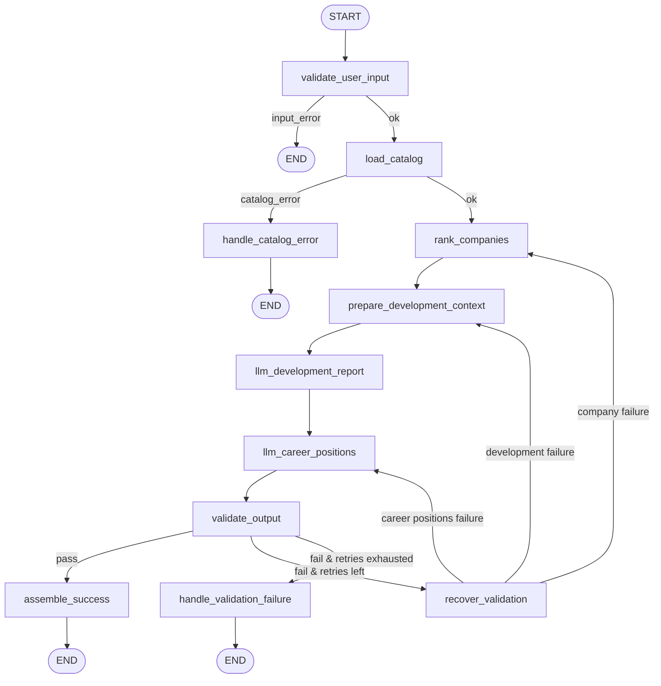

# recommendation-test-task

LangGraph career recommendation pipeline: ranked employers from a reference catalog, LLM-generated development areas, career position paths, and deterministic validation with recovery retries.

## Requirements

- Python 3.12+
- [uv](https://github.com/astral-sh/uv)
- Azure OpenAI / AI Foundry credentials

## Setup

```bash
uv sync

export AZURE_OPENAI_ENDPOINT="https://your-resource.openai.azure.com/"
export AZURE_OPENAI_API_KEY="your-key"
export AZURE_OPENAI_DEPLOYMENT_NAME="your-gpt-deployment"
# optional
export AZURE_OPENAI_API_VERSION="2024-08-01-preview"
export AZURE_OPENAI_MODEL_NAME="gpt-4o"          # shown in output; defaults to deployment name
export LLM_INPUT_COST_PER_1M_TOKENS="0.15"      # USD per 1M input tokens for cost estimate
export LLM_OUTPUT_COST_PER_1M_TOKENS="0.60"      # USD per 1M output tokens for cost estimate
```

## Run

```bash
uv run python main.py
uv run python main.py --user data/sample_user_input.json --catalog data/reference_catalog.json
```

## Graph



## Nodes

| Node | Type | Purpose |
|------|------|---------|
| `validate_user_input` | Pydantic | Validate user trait profile |
| `load_catalog` | Pydantic | Load employer reference catalog |
| `rank_companies` | LLM | Rank companies from catalog |
| `prepare_development_context` | Deterministic | Set allowed company names for narrative |
| `llm_development_report` | LLM | Development areas + narrative |
| `llm_career_positions` | LLM | Career positions with company role examples |
| `validate_output` | Deterministic | Validate outputs and company references |
| `recover_validation` | Recovery | Retry failed branch (max 3) |
| `assemble_success` | Terminal | Success response |
| `handle_catalog_error` | Terminal | Catalog load failure |
| `handle_validation_failure` | Terminal | Validation / retry exhaustion |

## Output

Success and validation-failure responses include an `llm_usage` summary with the model, deployment, token counts, estimated cost (USD), and a per-call breakdown. Usage accumulates across validation retries.

```json
{
  "status": "success",
  "recommended_companies": [],
  "development_report": [],
  "career_positions": [],
  "narrative": "",
  "llm_usage": {
    "model": "gpt-4o",
    "deployment": "your-gpt-deployment",
    "provider": "azure_openai",
    "total_prompt_tokens": 4200,
    "total_completion_tokens": 1800,
    "total_tokens": 6000,
    "estimated_cost_usd": 0.00171,
    "calls": [
      {
        "step": "rank_companies",
        "model": "gpt-4o",
        "deployment": "your-gpt-deployment",
        "provider": "azure_openai",
        "prompt_tokens": 1400,
        "completion_tokens": 600,
        "total_tokens": 2000,
        "estimated_cost_usd": 0.00057
      }
    ]
  }
}
```

## Project layout

```
recommendation/
├── graph.py              # LangGraph wiring
├── nodes.py              # Graph node handlers
├── companies/            # Company ranking (LLM)
├── development/          # Development report (LLM)
├── career_positions/     # Career paths (LLM)
├── llm/                  # Centralized Azure LLM client + usage tracking
│   ├── client.py
│   └── usage.py
├── schemas/              # LLM structured output models
└── models.py             # Input & catalog Pydantic models
data/
├── reference_catalog.json
└── sample_user_input.json
main.py
```
